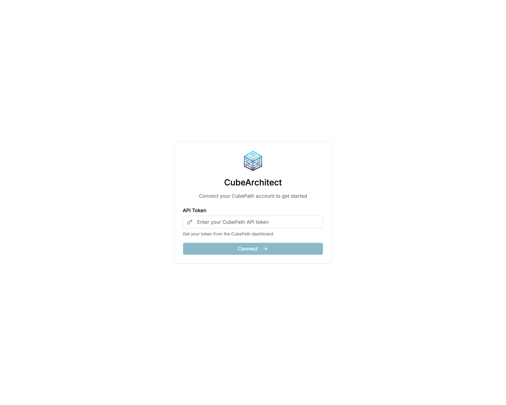
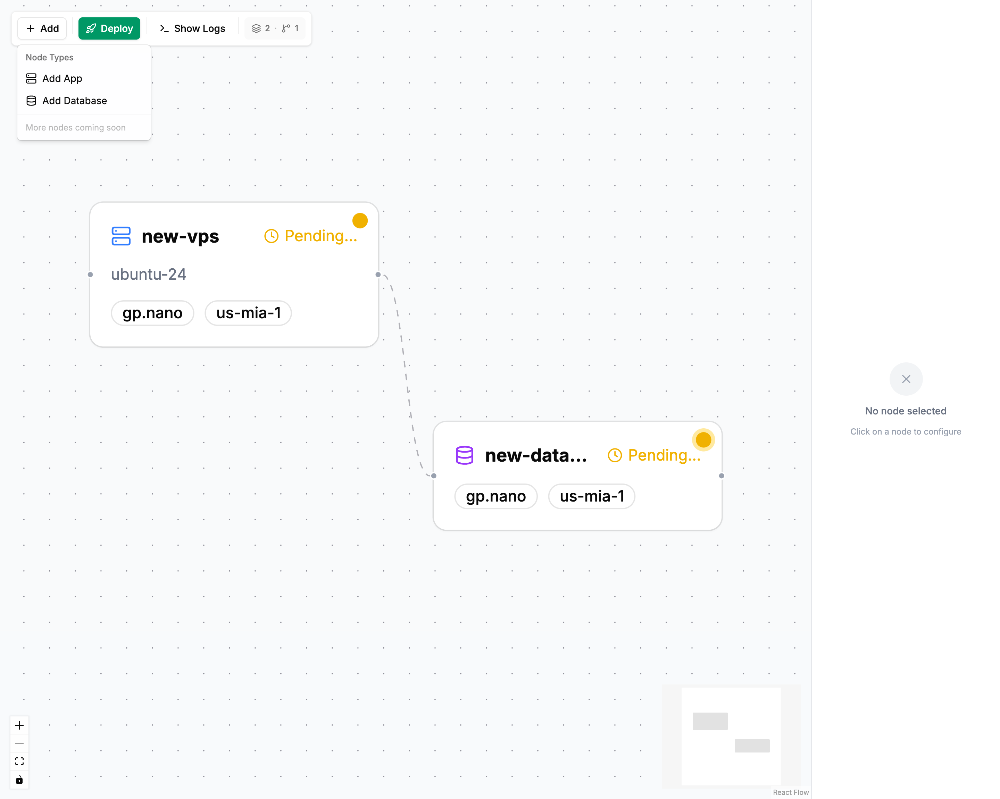
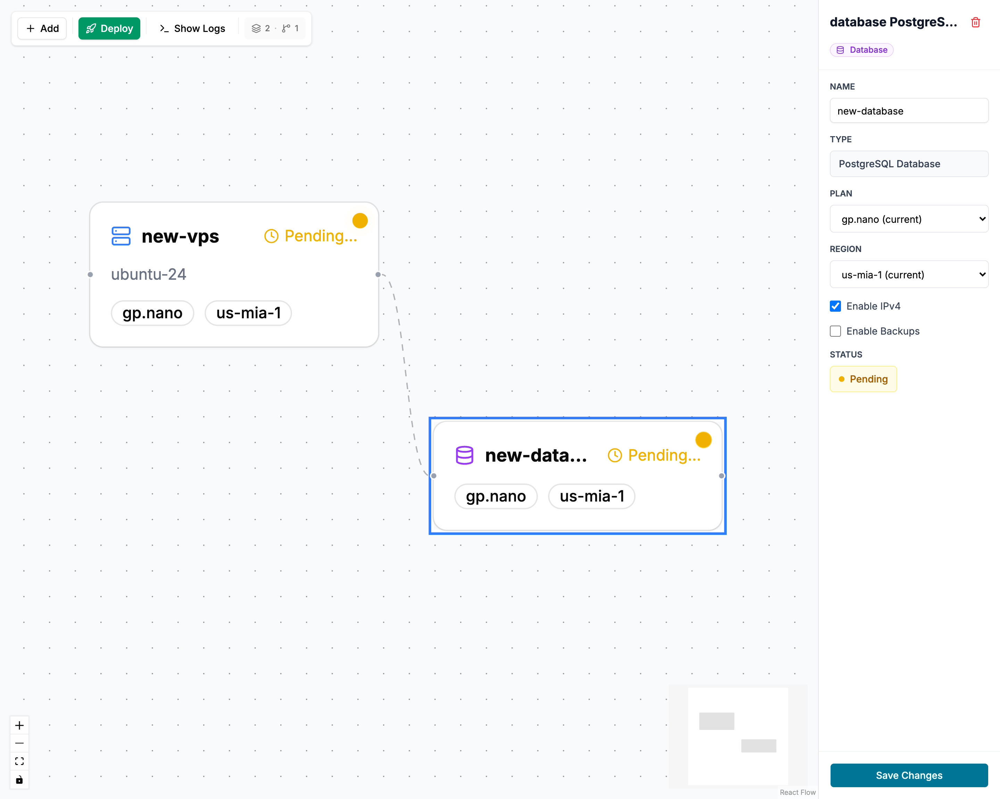
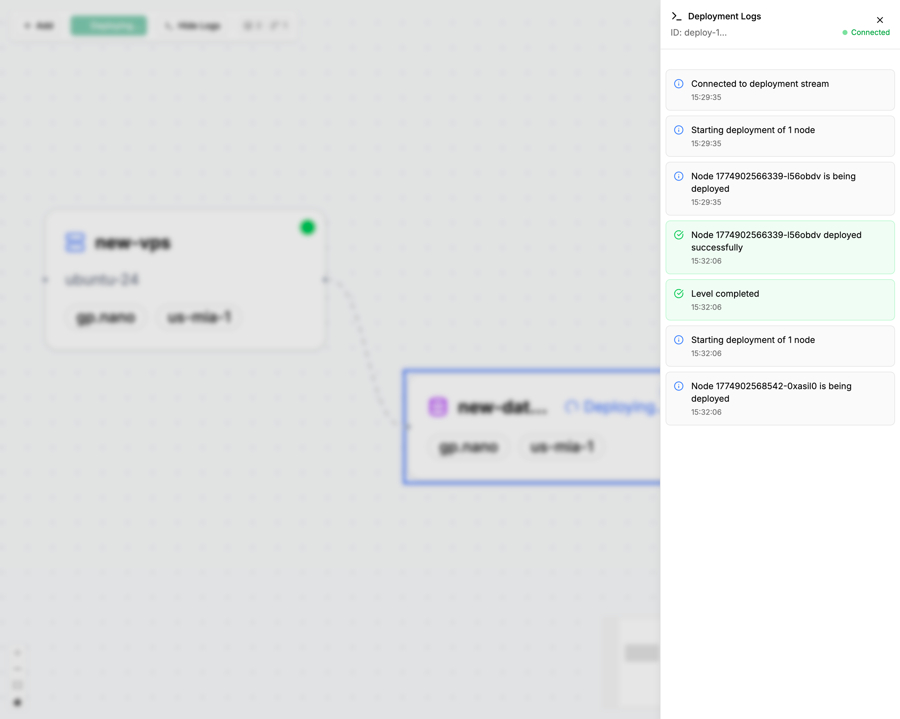

# 🏗️ CubeArquitect

**Editor visual para diseñar y desplegar arquitecturas de infraestructura en CubePath**

[](https://go.dev/)
[](https://react.dev/)
[](https://www.typescriptlang.org/)
[](https://cubepath.com/)
[](https://gofiber.io/)

---

CubeArquitect es una herramienta que permite crear arquitecturas de infraestructura mediante un editor visual de nodos. Cada nodo representa un VPS que se despliega automáticamente en CubePath con código boilerplate preconfigurado según su tipo.

- **Nodos**: App (aplicaciones) y Database (bases de datos)
- **Sistema DAG**: Despliegue por niveles - los nodos sin dependencias entre sí se despliegan en paralelo
- **Inyección de variables**: Las conexiones entre nodos permiten inyectar automáticamente valores (ej: DATABASE_URL de Database → App)

## ✨ Características

- 🎨 **Editor visual drag-and-drop** para diseñar arquitecturas de infraestructura
- 🖥️ **Nodos con boilerplate**: App y Database vienen con código preconfigurado listo para desplegar
- 🔗 **Sistema DAG**: Despliegue por niveles - nodos sin dependencias se despliegan en paralelo ([alg0.dev - topological sorting](https://www.alg0.dev/topological-sort))
- 💉 **Inyección de variables**: Conecta nodos y las dependencias (ej: DATABASE_URL) se injectan automáticamente
- 🚀 **Despliegue automático** en CubePath desde el editor visual
- 📡 **Logs en tiempo real** del proceso de despliegue
- ⚙️ **Panel de configuración** por tipo de nodo

## 🧱 Demo

🚀 **Prueba la aplicación:** [http://vps23781.cubepath.net:3001/](http://vps23781.cubepath.net:3001/)

> **Nota**: Para usar la demo necesitas:
> 1. Crear un API Token en [CubePath](https://my.cubepath.com/account/tokens)
> 2. Crear al menos una SSH Key en [CubePath](https://my.cubepath.com/ssh-keys)

## 🚀 Cómo comenzar

### Prerrequisitos

- Go 1.21+
- Node.js 18+
- Credenciales de CubePath (API Token)

### Instalación

```bash
# Clonar el repositorio
git clone https://github.com/tu-usuario/cubearquitect.git
cd cubearquitect

# Backend
cd backend
go mod download
go run cmd/api/main.go

# Frontend (en otra terminal)
cd ../frontend
npm install
npm run dev
```

## 🛠️ Tecnologías

| Capa | Tecnología |
|------|------------|
| Backend | Go + Fiber |
| Frontend | React + TypeScript + Vite |
| UI | shadcn/ui + Tailwind CSS |
| Editor visual | React Flow |
| Deployment | **CubePath** |

## 📸 Screenshots

### 🔐 Account Setup

*Configura tu API Token de CubePath para comenzar*

### 🎨 Editor Visual

*Arrastra y conecta nodos para diseñar tu arquitectura*

### ⚙️ Configuración de Nodos

*Configura cada nodo con planes, ubicaciones y templates*

### 🚀 Despliegue

*Monitorea el despliegue en tiempo real*

## 📂 Estructura del proyecto

```
cubearquitect/
├── backend/                   # API en Go + Fiber
│   ├── cmd/api/main.go       # Punto de entrada
│   └── internal/
│       ├── cubepath/         # Cliente de CubePath
│       ├── orchestrator/     # Motor de despliegue
│       │   ├── blueprints_app.go
│       │   ├── blueprints_database.go
│       │   ├── engine.go
│       │   └── dag.go
│       └── service/          # Lógica de negocio
└── frontend/                  # App React
    └── src/
        ├── components/
        │   ├── flow/         # Editor visual
        │   └── nodes/        # Nodos personalizados
        ├── hooks/           # Custom hooks
        ├── services/        # API y servicios
        └── stores/          # Estado global
```

## 🗺️ Roadmap

- [ ] Soporte para más tipos de nodos (Redis, Cache, etc.)
- [ ] Templates predefinidos de arquitecturas
- [ ] Guardar y cargar proyectos
- [ ] Sistema de autenticación de usuarios
- [ ] Dashboard de proyectos y despliegues
- [ ] Historial de despliegues

## ☁️ Despliegue en CubePath

El proyecto está desplegado en **CubePath** utilizando **Dokploy** (Docker Compose):

- **Infraestructura**: Docker Compose en un VPS de CubePath
- **Servicios**: Backend (Go + Fiber) + Frontend (React + Vite) en el mismo VPS
- **Puerto**: 3001 (expuesto via Docker)

### Despliegue con Dokploy

El proyecto utiliza un archivo `docker-compose.yml` para orquestar los servicios:

```yaml
services:
  backend:
    build: ./backend
    environment:
      - CUBE_API_URL=${CUBE_API_URL:-https://api.cubepath.com}
      - PORT=${PORT:-8080}

  frontend:
    build: ./frontend
    ports:
      - "3001:80"  # Puerto 3001 del host -> Puerto 80 del contenedor
```

El backend utiliza el cliente oficial de CubePath para:
1. Crear VPS según la configuración de cada nodo
2. Configurar las conexiones entre nodos
3. Obtener información de estado en tiempo real

## 📝 Requisitos del Hackaton

✅ Proyecto desplegado en **CubePath**  
✅ Repositorio público  
✅ README con descripción, demo y screenshots  
✅ Explicación del uso de CubePath  

---

Hecho con ❤️ para la **Hackaton CubePath 2026**
